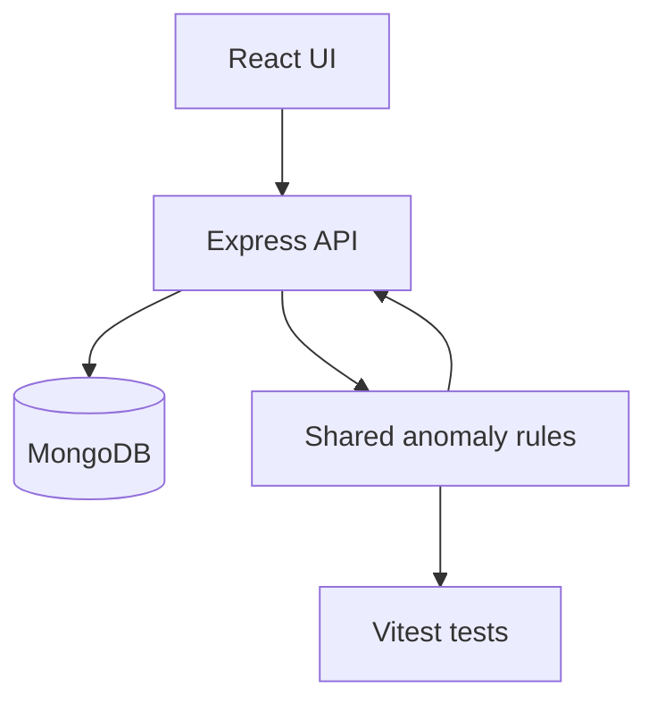

# Dialysis Session Intake & Anomaly Dashboard

A small full-stack TypeScript app for tracking dialysis sessions, surfacing basic clinical anomalies, and giving nurses a compact intake dashboard.

## Setup

1. Clone the repository and enter the project folder.
2. Install dependencies with `npm install` at the repository root.
3. Start MongoDB locally, or run `docker compose up -d mongo` if Docker is available.
4. Copy `.env.example` to `.env` and adjust values if needed.
5. Run `npm run seed` once, then `npm run dev`.

The app runs at `http://localhost:5173` and the API runs at `http://localhost:4000` by default.

## Architecture

The frontend is a Vite React app that fetches the current schedule, lets a nurse add a session, updates notes, and filters to anomalies. The backend owns data access, session shaping, and anomaly calculations. The anomaly rules live in `shared/` so the UI, API, and tests use the same assumptions.

## Assumptions and Trade-offs

- Excess interdialytic weight gain is flagged at more than 3.0 kg or more than 5% above dry weight, whichever is lower to trigger earlier review.
- High post-dialysis systolic BP is flagged at 180 mmHg or higher.
- Abnormal duration is flagged when a session differs from the configured target by more than 30 minutes.
- The app uses a simple document model in MongoDB with denormalized patient data inside a session projection for easier dashboard reads.
- The demo keeps auth out of scope so the assignment stays focused on workflow and data shaping.

## Known Limitations

- No authentication or role-based access control.
- No real-time updates; the UI refreshes by refetching data.
- The anomaly rules are intentionally simple and should be validated by clinicians before any real-world use.
- The demo assumes a single unit at a time and a small dataset.

## What I Would Do Next

- Add authentication and audit logging.
- Add server-side pagination and search.
- Add a persisted schedule generator instead of seed-only sample data.
- Replace the handwritten status UI with a reusable component library.
- Add route-level tests for the dashboard API and session updates.

## Scripts

- `npm run dev` - runs both apps.
- `npm run build` - builds server and client.
- `npm run test` - runs the server test suite.
- `npm run seed` - inserts example patients and sessions.
